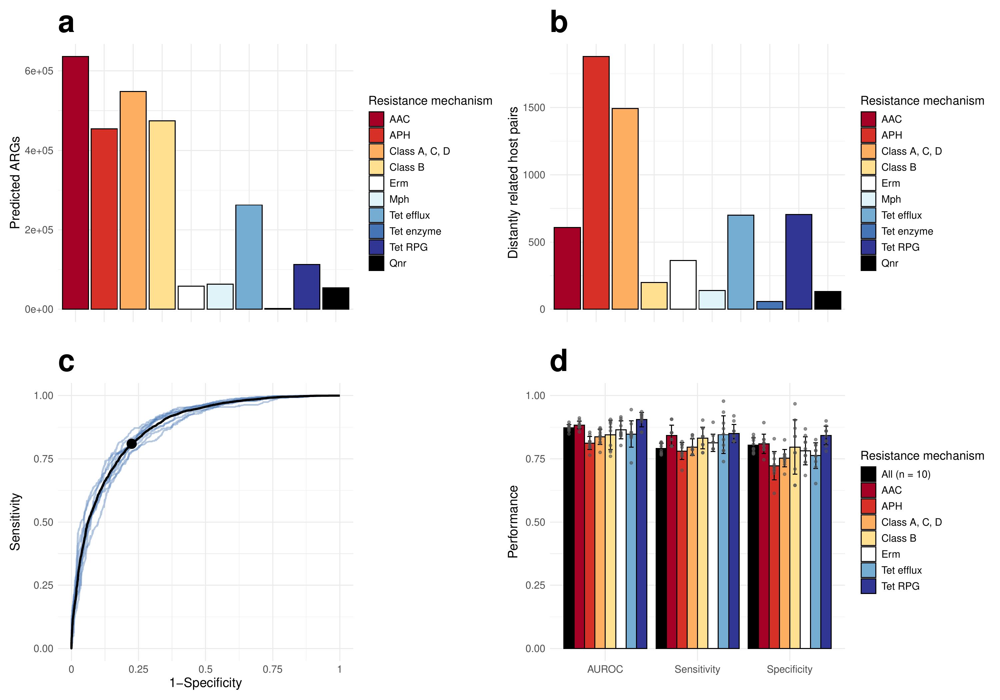

#----------------- Figure 2a,b ------------------------------------------------
# Load packages
library(readxl)
library(ggplot2)

# Plotting settings
fig_ab_theme <- theme(
  axis.text.x = element_blank(),
  axis.text.y = element_text(size = rel(1.3)),
  axis.title = element_text(size = rel(1.3)),
  legend.title = element_text(size = rel(1.2)),
  legend.text = element_text(size = rel(1)),
  plot.title = element_text(size = rel(3), face = "bold")
)

mechanism_palette <- c(
  "AAC" = '#a50026', 
  "APH" = "#d73027", 
  "Class A, C, D" = '#fdae61',
  "Class B" = "#fee090", 
  "Erm" = "#ffffff", 
  "Mph" = "#e0f3f8",
  "Tet efflux" = "#74add1", 
  "Tet enzyme" = "#4575b4", 
  "Tet RPG" = "#313695",
  "Qnr" = "#000000"
)

# Load data
df <- read_excel("D:/data_diver/Genetic_compatibility/data_for_figures/summary_transferred_args.xlsx")
df <- as.data.frame(df)

# Analysis
aggregated_data <- data.frame(matrix(nrow=10, ncol=4))
colnames(aggregated_data) <- c("mechanism", "antibiotic_class", "predicted_ARGs", "HGT_Transfers")
aggregated_data$mechanism <- c("AAC", "APH", "Class A, C, D", "Class B", "Qnr", "Erm", "Mph", "Tet efflux", "Tet enzyme", "Tet RPG")
aggregated_data$antibiotic_class <- c(rep("Aminoglycoside", 2), rep("Beta-lactam", 2), "Fluoroquinolone", rep("Macrolide", 2), rep("Tetracycline", 3))

for (mech in unique(aggregated_data$mechanism)) {
  if (mech == "Class A, C, D") {
    aggregated_data[aggregated_data$mechanism == "Class A, C, D", 3:4] <- colSums(df[df$gene_class == "Class A" | df$gene_class == "Class C" | df$gene_class == "Class D1" | df$gene_class == "Class D2", 3:4])
  }
  else {
    aggregated_data[aggregated_data$mechanism == mech, 3:4] <- colSums(df[grep(mech, df$gene_class), 3:4])
  }
}

mech_levels <- c("AAC", "APH", "Class A, C, D", "Class B", "Erm", "Mph", "Tet efflux", "Tet enzyme", "Tet RPG", "Qnr")

# Plot figures
fig_2a <- ggplot(data = aggregated_data, aes(x = factor(mechanism, levels = mech_levels), 
                                             y = predicted_ARGs, fill = factor(mechanism, levels = mech_levels))) +
  geom_bar(position="dodge", stat="identity", color="black") +
  ggtitle("a") +
  xlab("") +
  ylab("Predicted ARGs") +
  theme_minimal() +
  scale_fill_manual(values=mechanism_palette, name = "Resistance mechanism") +
  fig_ab_theme

fig_2b <- ggplot(data = aggregated_data, aes(x = factor(mechanism, levels = mech_levels), 
                                             y = HGT_Transfers, fill = factor(mechanism, levels = mech_levels))) +
  geom_bar(position="dodge", stat="identity", color="black") +
  ggtitle("b") +
  xlab("") +
  ylab("Distantly related host pairs") +
  theme_minimal() +
  scale_fill_manual(values=mechanism_palette, name = "Resistance mechanism") +
  fig_ab_theme

#----------------- Figure 2c,d ------------------------------------------------
# Load packages
library(caret)
library(dplyr)
library(tidyr)
library(forcats)
library(data.table)
library(randomForest)
library(pROC)
library(utils)
library(patchwork)

# Functions
remove_redundant_events <- function(events) {
  uniq_events <- unique(events[, c("Node", "Gene.class")])
  subtable <- data.frame(matrix(nrow = 0, ncol = ncol(events)))
  colnames(subtable) <- colnames(events)
  
  for (i in seq_len(nrow(uniq_events))) {
    redundant_events <- events[events$Node == uniq_events$Node[i] & events$Gene.class == uniq_events$Gene.class[i], ]
    if (nrow(redundant_events) > 10) {
      subtable <- rbind(subtable, redundant_events[sample(seq_len(nrow(redundant_events)), 10), ])
    } else {
      subtable <- rbind(subtable, redundant_events)
    }
  }
  return(subtable)
}

subsample_null_events <- function(true, null) {
  gene_class <- unique(true$Gene.class)
  downsampled_events <- data.frame()
  tmp <- data.frame()
  
  for (class in gene_class) {
    n <- sum(true$Gene.class == class)
    subset <- null[null$Gene.class == class, ]
    if (nrow(subset) > n) {
      selection <- sample(seq_len(nrow(subset)), n)
      downsampled_events <- rbind(downsampled_events, subset[selection, ])
      tmp <- rbind(tmp, subset[-selection, ])
    } else {
      downsampled_events <- rbind(downsampled_events, subset)
    }
  }
  
  n_left <- nrow(true) - nrow(downsampled_events)
  downsampled_events <- rbind(downsampled_events, tmp[sample(seq_len(nrow(tmp)), n_left), ])
  
  return(downsampled_events)
}

format_input_data <- function(true_data, null_data, mechanism) {
  true_data$Transfer <- 1
  null_data$Transfer <- 0
  
  if (mechanism != "all") {
    if (mechanism == "class_A_C_D") {
      true_data <- true_data[true_data$Gene.class %in% c("class_A", "class_C", "class_D_1", "class_D_2"), ]
      null_data <- null_data[null_data$Gene.class %in% c("class_A", "class_C", "class_D_1", "class_D_2"), ]
    }
    
    else {
      true_data <- true_data[grep(mechanism, true_data$Gene.class), ]
      null_data <- null_data[grep(mechanism, null_data$Gene.class), ]
    }
  }
  
  true_data <- remove_redundant_events(true_data)
  if (nrow(null_data) > nrow(true_data)) {
    null_data <- subsample_null_events(true_data, null_data)
  }
  
  input_data <- rbind(true_data, null_data)
  input_data$Transfer <- as.factor(input_data$Transfer)
  input_data$Gene.class <- as.factor(input_data$Gene.class)
  
  input_data <- input_data %>%
    mutate(
      NN = as.integer(Gram_stain_difference == "NN"),
      PP = as.integer(Gram_stain_difference == "PP"),
      NP = as.integer(Gram_stain_difference == "NP")
    )
  
  return(input_data)
}

get_distance_top_left <- function(sens_spec) {
  d <- sqrt(sum((sens_spec - c(1,1))^2))
  return(d)
}

# Plotting settings
fig_cd_theme <- theme(
  axis.text.x = element_text(size = rel(1.3)),
  axis.text.y = element_text(size = rel(1.3)),
  axis.title = element_text(size = rel(1.3)),
  legend.title = element_text(size = rel(1.2)),
  legend.text = element_text(size = rel(1)),
  plot.title = element_text(size = rel(3), face = "bold")
)

aggregated_palette <- c(
  "All (n = 10)" ="#000000",
  "AAC"='#a50026',
  "APH" ="#d73027",
  "Class A, C, D"='#fdae61',
  "Class B"="#fee090",
  "Erm" = "#ffffff",
  "Tet efflux" = "#74add1",
  "Tet RPG" = "#313695"
)

set.seed(1)

observed_transfers <- data.frame(fread("D:/data_diver/Genetic_compatibility/data_for_figures/observed_horizontal_transfers.txt")) %>% 
  subset(select = -c(Header1, Header2)) %>%
  na.omit()
mechanisms <- c("all", "aac", "aph", "class_A_C_D", "class_B", "erm", "tet_efflux", "tet_rpg")
performance <- data.frame()

# Analysis
for (class in mechanisms) {
  perf <- data.frame(matrix(ncol=3, nrow=10))
  colnames(perf) <- c("AUROC", "Sensitivity", "Specificity")
  
  print(paste(c("Generating", class, "models"), collapse=" "))
  
  pb <- txtProgressBar(min = 0, max = 10, initial = 0, style = 3)
  
  for (i in 1:10){
    randomized_transfers <- read.delim(paste(c("D:/data_diver/Genetic_compatibility/data_for_figures/randomized_transfers", i, ".txt"), collapse = "")) %>%
      na.omit()
    
    input_data <- format_input_data(observed_transfers, randomized_transfers, class) %>% 
      select(Gene.class, NN, PP, NP, Genome_5mer_distance,
             Gene_genome_5mer_distance, Genome_size_difference,
             Animal, Human, Soil, Water, Wastewater, Transfer)
    
    train_index <- createDataPartition(input_data$Transfer, times = 1, p = 0.7, list = FALSE)
    train_set <- input_data %>% slice(train_index)
    test_set <- input_data %>% slice(-train_index)
    
    rf_model <- randomForest(Transfer ~ .,
                             data = train_set, 
                             ntree = 500, 
                             type = "classification", 
                             na.action=na.omit, 
                             importance = TRUE)
    
    p_hat_test <- as.data.frame(predict(rf_model, newdata = test_set, type = "prob"))
    suppressMessages(roc_test <- roc(test_set$Transfer ~ p_hat_test$`1`, plot=FALSE, smooth = FALSE))
    best_point <- coords(roc_test, "best", best.method = "closest.topleft")
    
    y_hat_test <- predict(rf_model, newdata = test_set, cutoff = c(1 - as.numeric(best_point["threshold"][[1]])[1], as.numeric(best_point["threshold"][[1]])[1]))
    
    conf <- caret::confusionMatrix(y_hat_test, test_set$Transfer, positive='1')
    
    perf$AUROC[i] <- auc(roc_test)
    perf$Sensitivity[i] <- conf$byClass[[1]]
    perf$Specificity[i] <- conf$byClass[[2]]
    
    if (class == "all") {
      suppressMessages(assign(paste(c("roc", i), collapse = ""), roc_test))
    }
    
    setTxtProgressBar(pb, i)
  }
  
  close(pb)
  
  perf$mechanism <- class
  performance <- rbind(performance, perf)
  
}

# Compile results
sensitivities <- list(roc1$sensitivities, roc2$sensitivities,
                      roc3$sensitivities, roc4$sensitivities,
                      roc5$sensitivities, roc6$sensitivities,
                      roc7$sensitivities, roc8$sensitivities,
                      roc9$sensitivities, roc10$sensitivities)

specificities <- list(roc1$specificities, roc2$specificities,
                      roc3$specificities, roc4$specificities,
                      roc5$specificities, roc6$specificities,
                      roc7$specificities, roc8$specificities,
                      roc9$specificities, roc10$specificities)

roc_data <- data.frame(Sensitivity = tapply(unlist(sensitivities), sequence(lengths(sensitivities)), mean), 
                       Specificity = tapply(unlist(specificities), sequence(lengths(specificities)), mean))

euc_dist <- apply(roc_data, 1, get_distance_top_left)

mech_names_adj <- c("All (n = 10)", "AAC", "APH", "Class A, C, D", "Class B", "Erm", "Tet efflux", "Tet RPG")

for (i in 1:length(mechanisms)) {
  performance$mechanism[performance$mechanism == mechanisms[i]] <- mech_names_adj[i]
}

performance$mechanism <- factor(performance$mechanism, levels = mech_names_adj)

performance_long <- reshape2::melt(performance, id.vars = "mechanism", variable.name = "Metric", value.name = "Performance")

performance_summary <- performance %>%
  group_by(mechanism) %>%
  summarise(
    AUROC_mean = mean(AUROC), AUROC_sd = sd(AUROC),
    Sensitivity_mean = mean(Sensitivity), Sensitivity_sd = sd(Sensitivity),
    Specificity_mean = mean(Specificity), Specificity_sd = sd(Specificity)
  ) %>%
  tidyr::pivot_longer(cols = -mechanism, names_to = c("Metric", ".value"), names_sep = "_")

performance_long <- performance %>%
  tidyr::pivot_longer(cols = -mechanism, names_to = "Metric", values_to = "Performance")

dodge_width <- 0.9  

# Plot figures
fig_2c <- ggplot() +
  geom_line(aes(x = roc1$specificities, y = roc1$sensitivities), col = "#4575b4", linewidth=0.8, alpha = 0.4) +
  geom_line(aes(x = roc2$specificities, y = roc2$sensitivities), col = "#4575b4", linewidth=0.8, alpha = 0.4) +
  geom_line(aes(x = roc3$specificities, y = roc3$sensitivities), col = "#4575b4", linewidth=0.8, alpha = 0.4) +
  geom_line(aes(x = roc4$specificities, y = roc4$sensitivities), col = "#4575b4", linewidth=0.8, alpha = 0.4) +
  geom_line(aes(x = roc5$specificities, y = roc5$sensitivities), col = "#4575b4", linewidth=0.8, alpha = 0.4) +
  geom_line(aes(x = roc6$specificities, y = roc6$sensitivities), col = "#4575b4", linewidth=0.8, alpha = 0.4) +
  geom_line(aes(x = roc7$specificities, y = roc7$sensitivities), col = "#4575b4", linewidth=0.8, alpha = 0.4) +
  geom_line(aes(x = roc8$specificities, y = roc8$sensitivities), col = "#4575b4", linewidth=0.8, alpha = 0.4) +
  geom_line(aes(x = roc9$specificities, y = roc9$sensitivities), col = "#4575b4", linewidth=0.8, alpha = 0.4) +
  geom_line(aes(x = roc10$specificities, y = roc10$sensitivities), col = "#4575b4", linewidth=0.8, alpha = 0.4) +
  geom_line(aes(x = roc_data$Specificity, y = roc_data$Sensitivity), col = "#000000", linewidth=1.1) +
  geom_point(aes(x = roc_data$Specificity[euc_dist==min(euc_dist)], y = roc_data$Sensitivity[euc_dist==min(euc_dist)]), size = 4.5, color= "#000000") +
  scale_x_reverse(labels = function(x) 1 - x) +
  theme_minimal() +
  ggtitle("c") +
  ylab("Sensitivity") +
  xlab("1-Specificity") +
  fig_cd_theme

fig_2d <- ggplot() +
  geom_bar(data = performance_summary, aes(x = Metric, y = mean, fill = mechanism), 
           stat = "identity", position = position_dodge(dodge_width), color = "black") +
  geom_errorbar(data = performance_summary, aes(x = Metric, ymin = mean - sd, ymax = mean + sd, group = mechanism), 
                width = 0.4, position = position_dodge(dodge_width)) +
  geom_jitter(data = performance_long, aes(x = Metric, y = Performance, group = mechanism), 
              position = position_dodge(dodge_width), alpha = 0.6, size = 1.2, color = "#525252") +
  theme_minimal() +
  scale_fill_manual(values=aggregated_palette, name = "Resistance mechanism") + 
  ggtitle("d") +
  xlab("") +
  ylab("Performance") +
  ylim(0,1) +
  fig_cd_theme

# Compile and save Fig 2
pdf("fig_2.pdf", width = 15, height = 10.5)
fig_2a + fig_2b + fig_2c + fig_2d
dev.off()

#安装“Markdown All in One”扩展后，使用Ctrl+Shift+V 打开预览窗口

