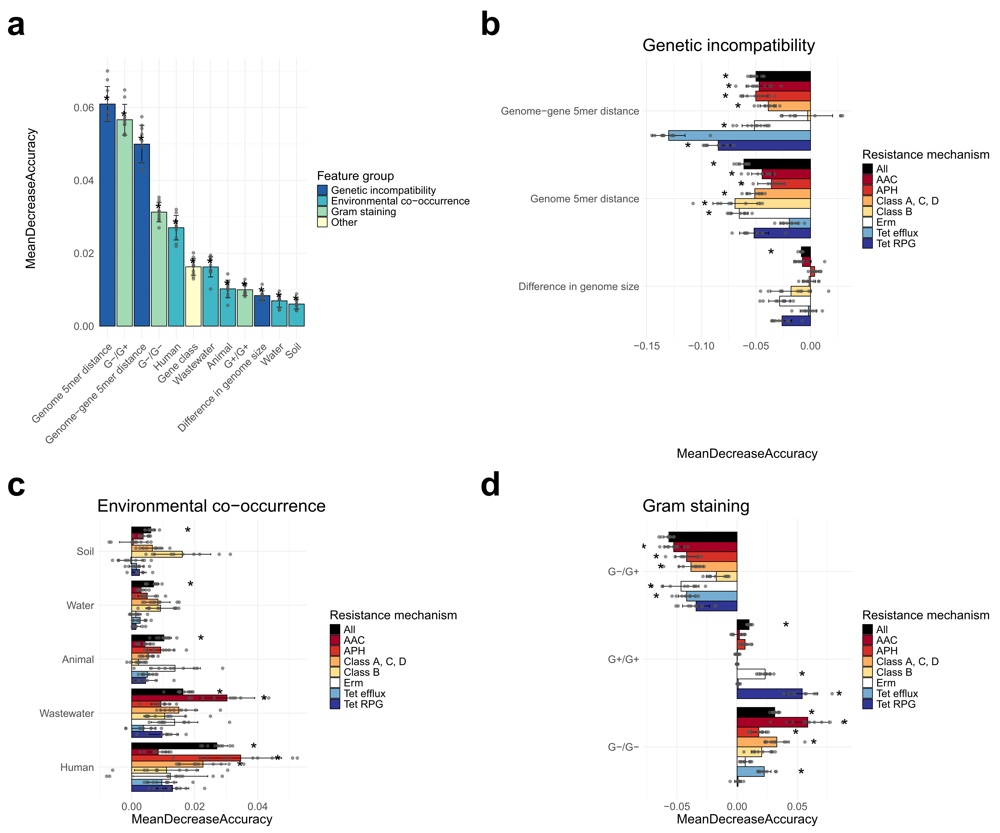

#----------------- Figure 3 ---------------------------------------------------
# Load packages
library(caret)   #需安装"future.apply"和“recipes”包才能启动
library(dplyr)
library(forcats)
library(data.table)
library(randomForest)
library(pROC)
library(boot)
library(rfPermute)
library(rfUtilities) #已从cran中移除，需去https://cran.r-project.org/src/contrib/Archive/rfUtilities/ 下载
library(parallel)
library(patchwork)

# Functions
remove_redundant_events <- function(events) {
  uniq_events <- unique(events[, c("Node", "Gene.class")])
  subtable <- data.frame(matrix(nrow = 0, ncol = ncol(events)))
  colnames(subtable) <- colnames(events)
  
  for (i in seq_len(nrow(uniq_events))) {
    redundant_events <- events[events$Node == uniq_events$Node[i] & events$Gene.class == uniq_events$Gene.class[i], ]
    if (nrow(redundant_events) > 10) {
      subtable <- rbind(subtable, redundant_events[sample(seq_len(nrow(redundant_events)), 10), ])
    } else {
      subtable <- rbind(subtable, redundant_events)
    }
  }
  return(subtable)
}

subsample_null_events <- function(true, null) {
  gene_class <- unique(true$Gene.class)
  downsampled_events <- data.frame()
  tmp <- data.frame()
  
  for (class in gene_class) {
    n <- sum(true$Gene.class == class)
    subset <- null[null$Gene.class == class, ]
    if (nrow(subset) > n) {
      selection <- sample(seq_len(nrow(subset)), n)
      downsampled_events <- rbind(downsampled_events, subset[selection, ])
      tmp <- rbind(tmp, subset[-selection, ])
    } else {
      downsampled_events <- rbind(downsampled_events, subset)
    }
  }
  
  n_left <- nrow(true) - nrow(downsampled_events)
  downsampled_events <- rbind(downsampled_events, tmp[sample(seq_len(nrow(tmp)), n_left), ])
  
  return(downsampled_events)
}

format_input_data <- function(true_data, null_data, mechanism) {
  true_data$Transfer <- 1
  null_data$Transfer <- 0
  
  if (mechanism != "all") {
    if (mechanism == "class_A_C_D") {
      true_data <- true_data[true_data$Gene.class %in% c("class_A", "class_C", "class_D_1", "class_D_2"), ]
      null_data <- null_data[null_data$Gene.class %in% c("class_A", "class_C", "class_D_1", "class_D_2"), ]
    }
    
    else {
      true_data <- true_data[grep(mechanism, true_data$Gene.class), ]
      null_data <- null_data[grep(mechanism, null_data$Gene.class), ]
    }
  }
  
  true_data <- remove_redundant_events(true_data)
  if (nrow(null_data) > nrow(true_data)) {
    null_data <- subsample_null_events(true_data, null_data)
  }
  
  input_data <- rbind(true_data, null_data)
  input_data$Transfer <- as.factor(input_data$Transfer)
  input_data$Gene.class <- as.factor(input_data$Gene.class)
  
  input_data <- input_data %>%
    mutate(
      NN = as.integer(Gram_stain_difference == "NN"),
      PP = as.integer(Gram_stain_difference == "PP"),
      NP = as.integer(Gram_stain_difference == "NP")
    )
  
  return(input_data)
}

get_distance_top_left <- function(sens_spec) {
  d <- sqrt(sum((sens_spec - c(1,1))^2))
  return(d)
}

calc_effect_size <- function(model) {
  es <- data.frame(matrix(nrow=1, ncol=15))
  colnames(es) <- c("NN", "PP", "NP", "Genome_5mer_distance", "Gene_genome_5mer_distance", "Genome_size_difference", "Animal", "Human.gut", "Human.skin", "Human.oral", "Freshwater", "Marine", "Soil", "Wastewater", "Gene.class")
  
  nn <- try(rf.effectSize(model$rf, y = test_set$NN, pred.data = test_set, x.var = NN), silent = TRUE)
  if (inherits(nn, "try-error") | is.na(nn)) {
    nn <- rf.effectSize(model$rf, y = train_set$NN, pred.data = train_set, x.var = NN)
  }
  es[1, "NN"] <- nn
  
  pp <- try(rf.effectSize(model$rf, y = test_set$PP, pred.data = test_set, x.var = PP), silent = TRUE)
  if (inherits(pp, "try-error") | is.na(pp)) {
    pp <- rf.effectSize(model$rf, y = train_set$PP, pred.data = train_set, x.var = PP)
  }
  es[1, "PP"] <- pp
  
  np <- try(rf.effectSize(model$rf, y = test_set$NP, pred.data = test_set, x.var = NP), silent = TRUE)
  if (inherits(np, "try-error") | is.na(np)) {
    np <- rf.effectSize(model$rf, y = train_set$NP, pred.data = train_set, x.var = NP)
  }
  es[1, "NP"] <- np
  
  
  gdist <- try(rf.effectSize(model$rf, y = test_set$Genome_5mer_distance, pred.data = test_set, x.var = Genome_5mer_distance), silent = TRUE)
  if (inherits(gdist, "try-error") | is.na(gdist)) {
    gdist <- rf.effectSize(model$rf, y = train_set$Genome_5mer_distance, pred.data = train_set, x.var = Genome_5mer_distance)
  }
  es[1, "Genome_5mer_distance"] <- gdist
  
  ggdist <- try(rf.effectSize(model$rf, y = test_set$Gene_genome_5mer_distance, pred.data = test_set, x.var = Gene_genome_5mer_distance), silent = TRUE)
  if (inherits(ggdist, "try-error") | is.na(ggdist)) {
    ggdist <- rf.effectSize(model$rf, y = train_set$Gene_genome_5mer_distance, pred.data = train_set, x.var = Gene_genome_5mer_distance)
  }
  es[1, "Gene_genome_5mer_distance"] <- ggdist
  
  gsize <- try(rf.effectSize(model$rf, y = test_set$Genome_size_difference, pred.data = test_set, x.var = Genome_size_difference), silent = TRUE)
  if (inherits(gsize, "try-error") | is.na(gsize)) {
    gsize <- rf.effectSize(model$rf, y = train_set$Genome_size_difference, pred.data = train_set, x.var = Genome_size_difference)
  }
  es[1, "Genome_size_difference"] <- gsize
  
  animal <- try(rf.effectSize(model$rf, y = test_set$Animal, pred.data = test_set, x.var = Animal), silent = TRUE)
  if (inherits(animal, "try-error") | is.na(animal)) {
    animal <- rf.effectSize(model$rf, y = train_set$Animal, pred.data = train_set, x.var = Animal)
  }
  es[1, "Animal"] <- animal
  
  human <- try(rf.effectSize(model$rf, y = test_set$Human, pred.data = test_set, x.var = Human), silent = TRUE)
  if (inherits(human, "try-error") | is.na(human)) {
    human <- rf.effectSize(model$rf, y = train_set$Human, pred.data = train_set, x.var = Human)
  }
  es[1, "Human"] <- human
  
  soil <- try(rf.effectSize(model$rf, y = test_set$Soil, pred.data = test_set, x.var = Soil), silent = TRUE)
  if (inherits(soil, "try-error") | is.na(soil)) {
    soil <- rf.effectSize(model$rf, y = train_set$Soil, pred.data = train_set, x.var = Soil)
  }
  es[1, "Soil"] <- soil
  
  water <- try(rf.effectSize(model$rf, y = test_set$Water, pred.data = test_set, x.var = Water), silent = TRUE)
  if (inherits(water, "try-error") | is.na(water)) {
    water <- rf.effectSize(model$rf, y = train_set$Water, pred.data = train_set, x.var = Water)
  }
  es[1, "Water"] <- water
  
  wwater <- try(rf.effectSize(model$rf, y = test_set$Wastewater, pred.data = test_set, x.var = Wastewater), silent = TRUE)
  if (inherits(wwater, "try-error") | is.na(wwater)) {
    wwater <- rf.effectSize(model$rf, y = train_set$Wastewater, pred.data = train_set, x.var = Wastewater)
  }
  es[1, "Wastewater"] <- wwater
  
  es[1, "Gene.class"] <- 1
  
  return(es)
}

# Plotting settings
fig_a_theme <- theme(axis.text.x=element_text(size = rel(1.95), angle = 45, vjust = 1, hjust = 1),
                     axis.text.y=element_text(size = rel(1.95)),
                     axis.title=element_text(size=rel(1.95)),
                     legend.title=element_text(size=rel(1.8)), 
                     legend.text=element_text(size=rel(1.5)),
                     plot.title = element_text(size = rel(2.5)),
                     plot.tag = element_text(size = rel(5), face = "bold"))

fig_bcd_theme <- theme(axis.text.x=element_text(size = rel(1.95)),
                       axis.text.y=element_text(size = rel(1.95)),
                       axis.title=element_text(size=rel(1.95)),
                       legend.title=element_text(size=rel(1.8)), 
                       legend.text=element_text(size=rel(1.5)),
                       plot.title = element_text(size = rel(2.5)),
                       plot.tag = element_text(size = rel(5), face = "bold"))

feature_category_palette <- c(
  "Genetic incompatibility" ="#225ea8",
  "Environmental co-occurrence"='#41b6c4',
  "Gram staining" ="#a1dab4",
  "Other"="#ffffcc"
)

mechanism_palette <- c(
  "All" ="#000000",
  "AAC"='#a50026',
  "APH" ="#d73027",
  "Class A, C, D"='#fdae61',
  "Class B"="#fee090",
  "Erm" = "#ffffff",
  "Tet efflux" = "#74add1",
  "Tet RPG" = "#313695"
)

set.seed(1)

# Analysis
observed_transfers <- data.frame(fread("D:/data_diver/Genetic_compatibility/data_for_figures/observed_horizontal_transfers.txt")) %>% 
  subset(select = -c(Header1, Header2)) %>%
  na.omit()

df_total <- data.frame()
mechanisms <- c("all", "aac", "aph", "class_A_C_D", "class_B", "erm", "tet_efflux", "tet_rpg")
importance_total <- data.frame()
dodge_width <- 0.9

for (class in mechanisms){
  print(class)
  imp_data <- data.frame()
  df <- data.frame(Feature = c("NN", "PP", "NP", "Genome_5mer_distance", 
                               "Gene_genome_5mer_distance", "Genome_size_difference", 
                               "Animal", "Human", "Soil", "Water", "Wastewater", 
                               "Gene.class"), 
                   mean_imp = rep(0, times = 12),
                   sd_imp = rep(0, times = 12), 
                   significance = rep("", times = 12))
  
  pb <- txtProgressBar(min = 0, max = 10, initial = 0, style = 3)
  
  for (j in 1:10) {
    randomized_transfers <- read.delim(paste(c("D:/data_diver/Genetic_compatibility/data_for_figures/randomized_transfers", j, ".txt"), collapse = "")) %>% 
      na.omit()
    
    input_data <- format_input_data(observed_transfers, randomized_transfers, class) %>% 
      subset(select = c(Gene.class, NN, PP, NP, Genome_5mer_distance,
                        Gene_genome_5mer_distance, Genome_size_difference,
                        Animal, Human, Soil, Water, Wastewater, Transfer))
    
    train_index <- createDataPartition(input_data$Transfer, times = 1, p = 0.7, list = FALSE)
    train_set <- input_data %>% slice(train_index)
    test_set <- input_data %>% slice(-train_index)
    
    rf_permute <- rfPermute(Transfer ~ ., 
                            data = train_set, 
                            na.action = na.omit,
                            num.cores = detectCores()-1)
    
    imp <- importance(rf_permute, scale = FALSE)[,5]
    pval <- importance(rf_permute, scale = FALSE)[,6]
    effect_size <- calc_effect_size(rf_permute)
    
    imp <- data.frame(MeanDecreaseAccuracy = imp, p.value = pval)
    imp$Feature <- rownames(imp)
    rownames(imp) <- NULL
    imp$MeanDecreaseAccuracy <- as.numeric(sign(effect_size[imp$Feature])*imp$MeanDecreaseAccuracy)
    
    imp_data <- rbind(imp_data, imp)
    
    setTxtProgressBar(pb, j)
  }
  
  imp_data$mechanism <- class
  importance_total <- rbind(importance_total, imp_data)
  
  for (f in df$Feature){
    df$mean_imp[df$Feature == f] <- mean(na.omit(imp_data$MeanDecreaseAccuracy[imp_data$Feature == f]))
    df$sd_imp[df$Feature == f] <- sd(na.omit(imp_data$MeanDecreaseAccuracy[imp_data$Feature == f]))
    
    if(sum(imp_data$p.value[imp_data$Feature == f] < 0.01) == 10) {
      df$significance[df$Feature == f] <- "*"
    }
  }
  
  df$class <- rep(class, times = 12)
  df_total <- rbind(df_total, df)
  
  if (class == "all") {
    # Compile results for Fig 3a
    plot_data_a <- data.frame(Feature = c("NN", "PP", "NP", "Genome_5mer_distance", 
                                          "Gene_genome_5mer_distance", "Genome_size_difference", 
                                          "Animal", "Human", "Soil", "Water", "Wastewater", 
                                          "Gene.class"), 
                              mean_imp = rep(0, times = 12),
                              sd_imp = rep(0, times = 12), 
                              significance = rep("", times = 12))
    
    for (f in plot_data_a$Feature){
      plot_data_a$mean_imp[plot_data_a$Feature == f] <- mean(abs(imp_data$MeanDecreaseAccuracy[imp_data$Feature == f]))
      plot_data_a$sd_imp[plot_data_a$Feature == f] <- sd(abs(imp_data$MeanDecreaseAccuracy[imp_data$Feature == f]))
      
      if(sum(imp_data$p.value[imp_data$Feature == f] < 0.01) == 10) {
        plot_data_a$significance[plot_data_a$Feature == f] <- "*"
      }
    }
    
    plot_data_a$var_categ <- rep(NA, times = nrow(plot_data_a))
    
    feat_names_to_adjust <- c("Genome_5mer_distance", "Gene_genome_5mer_distance", 
                              "Genome_size_difference", "Gene.class", "NN", 
                              "PP", "NP")
    feat_names_adj <- c("Genome 5mer distance", "Genome-gene 5mer distance", 
                        "Difference in genome size", "Gene class", "G-/G-", 
                        "G+/G+", "G-/G+")
    
    for (i in 1:length(feat_names_to_adjust)) {
      plot_data_a$Feature[plot_data_a$Feature == feat_names_to_adjust[i]] <- feat_names_adj[i]
      imp_data$Feature[imp_data$Feature == feat_names_to_adjust[i]] <- feat_names_adj[i]
    }
    
    genomic <- feat_names_adj[1:3]
    gram_diff <- feat_names_adj[5:7]
    cooccurrence <- c("Animal", "Human", "Soil", "Water", "Wastewater")
    
    for (i in 1:nrow(plot_data_a)){
      if (plot_data_a$Feature[i] %in% genomic){
        plot_data_a$var_categ[i] <- "Genetic incompatibility"
      }
      else if (plot_data_a$Feature[i] %in% cooccurrence){
        plot_data_a$var_categ[i] <- "Environmental co-occurrence"
      } 
      else if (plot_data_a$Feature[i] %in% gram_diff){
        plot_data_a$var_categ[i] <- "Gram staining"
      }
      else {
        plot_data_a$var_categ[i] <- "Other"
      }
    }
    
    imp_data$MeanDecreaseAccuracy <- abs(imp_data$MeanDecreaseAccuracy)
    
    # Plot Fig 3a
    fig_3a <- ggplot(plot_data_a, aes(x=factor(Feature, levels=Feature[order(mean_imp, decreasing = TRUE)]), 
                                      y=mean_imp, fill=as.factor(var_categ))) + 
      geom_bar(position = position_dodge(dodge_width), stat="identity", color="black") +
      geom_errorbar(aes(ymin=mean_imp-sd_imp, ymax=mean_imp+sd_imp), 
                    width=.3, position = position_dodge(dodge_width)) +
      geom_jitter(data = imp_data, aes(x = Feature, 
                                       y = MeanDecreaseAccuracy,
                                       group = mechanism), 
                  position = position_dodge(dodge_width), alpha = 0.6, size = 2, color = "#525252", inherit.aes = FALSE) +
      labs(title = "", x = "", y = "MeanDecreaseAccuracy", tag = "a") +
      scale_fill_manual(values=feature_category_palette, 
                        name = "Feature group",
                        breaks=c("Genetic incompatibility",
                                 "Environmental co-occurrence",
                                 "Gram staining",
                                 "Other")) +
      theme_minimal() +
      geom_text(aes(label=significance),
                position=position_dodge(width=0.75), 
                hjust=0.6, vjust = 0.3, size=10) +
      fig_a_theme
  }
  
  close(pb)
}

# Compile results for Fig 3b,c,d
plot_data <- df_total[df_total$Feature != "Gene.class",]

mech_names_adj <- c("All", "AAC", "APH", "Class A, C, D", "Class B", "Erm", "Tet efflux", "Tet RPG")

for (i in 1:length(mechanisms)) {
  plot_data$class[plot_data$class == mechanisms[i]] <- mech_names_adj[i]
  importance_total$mechanism[importance_total$mechanism == mechanisms[i]] <- mech_names_adj[i]
}

for (i in 1:length(feat_names_to_adjust)) {
  plot_data$Feature[plot_data$Feature == feat_names_to_adjust[i]] <- feat_names_adj[i]
  importance_total$Feature[importance_total$Feature == feat_names_to_adjust[i]] <- feat_names_adj[i]
}

plot_data$class <- factor(plot_data$class, levels=mech_names_adj)
plot_data$class <- fct_rev(factor(plot_data$class))

genetic_compatibility <- plot_data[plot_data$Feature %in% genomic,]
env_cooccurrence <- plot_data[plot_data$Feature %in% cooccurrence,]
gram <- plot_data[plot_data$Feature %in% gram_diff,]

genetic_compatibility_total <- importance_total[importance_total$Feature %in% genomic,]
env_cooccurrence_total <- importance_total[importance_total$Feature %in% cooccurrence,]
gram_total <- importance_total[importance_total$Feature %in% gram_diff,]

# Plot Fig 3b,c,d
fig_3b <- ggplot(genetic_compatibility, aes(fill=class, y=mean_imp, x=reorder(Feature, -mean_imp))) + 
  geom_bar(position = position_dodge(dodge_width), stat="identity", color="black") +
  geom_errorbar(aes(ymin=mean_imp-sd_imp, ymax=mean_imp+sd_imp), 
                width=.3, position = position_dodge(dodge_width)) +
  geom_jitter(data = genetic_compatibility_total, 
              aes(x = Feature,
                  y = MeanDecreaseAccuracy,
                  group = factor(mechanism, levels=rev(mech_names_adj))), 
              position = position_dodge(dodge_width), alpha = 0.6, size = 2, color = "#525252") +
  xlab(NULL) +
  ylab("MeanDecreaseAccuracy") +
  labs(title = "Genetic incompatibility", tag = "b") +
  geom_text(aes(label=significance),
            position=position_dodge(width=0.9), 
            hjust=-5*sign(genetic_compatibility$mean_imp), 
            vjust = 0.75, size=10) +
  scale_fill_manual(values=mechanism_palette, 
                    name = "Resistance mechanism",
                    breaks = rev(levels(genetic_compatibility$class))) + 
  coord_flip() +
  theme_minimal() +
  fig_bcd_theme

fig_3c <- ggplot(env_cooccurrence, aes(fill=class, y=mean_imp, x=reorder(Feature, -mean_imp))) + 
  geom_bar(position=position_dodge(dodge_width), stat="identity", color="black") +
  geom_errorbar(aes(ymin=mean_imp-sd_imp, ymax=mean_imp+sd_imp), 
                width=.3, position=position_dodge(dodge_width)) +
  geom_jitter(data = env_cooccurrence_total, 
              aes(x = Feature,
                  y = MeanDecreaseAccuracy,
                  group = factor(mechanism, levels=rev(mech_names_adj))),
              position = position_dodge(dodge_width), alpha = 0.6, size = 2, color = "#525252") +
  xlab(NULL) +
  ylab("MeanDecreaseAccuracy") +
  labs(title = "Environmental co-occurrence", tag = "c") +
  geom_text(aes(label=significance),
            position=position_dodge(width=0.9), 
            hjust=-5*sign(env_cooccurrence$mean_imp), 
            vjust = 0.75, size=10) +
  scale_fill_manual(values=mechanism_palette, 
                    name = "Resistance mechanism",
                    breaks = rev(levels(env_cooccurrence$class))) + 
  coord_flip() +
  theme_minimal() +
  fig_bcd_theme

fig_3d <- ggplot(gram, aes(fill=class, y=mean_imp, x=reorder(Feature, -mean_imp))) + 
  geom_bar(position=position_dodge(dodge_width), stat="identity", color="black") +
  geom_errorbar(aes(ymin=mean_imp-sd_imp, ymax=mean_imp+sd_imp), 
                width=.3, position=position_dodge(dodge_width)) +
  geom_jitter(data = gram_total, 
              aes(x = Feature,
                  y = MeanDecreaseAccuracy,
                  group = factor(mechanism, levels=rev(mech_names_adj))), 
              position = position_dodge(dodge_width), alpha = 0.6, size = 2, color = "#525252") +
  xlab(NULL) +
  ylab("MeanDecreaseAccuracy") +
  labs(title = "Gram staining", tag = "d") +
  geom_text(aes(label=significance),
            position=position_dodge(width=0.9), 
            hjust=-5*sign(gram$mean_imp), 
            vjust = 0.75, size=10) +
  scale_fill_manual(values=mechanism_palette, 
                    name = "Resistance mechanism",
                    breaks = rev(levels(gram$class))) + 
  coord_flip() +
  theme_minimal() +
  fig_bcd_theme

pdf("fig_3.pdf", width = 22.5, height = 18.75)
fig_3a + fig_3b + fig_3c + fig_3d
dev.off()

#安装“Markdown All in One”扩展后，使用Ctrl+Shift+V 打开预览窗口

