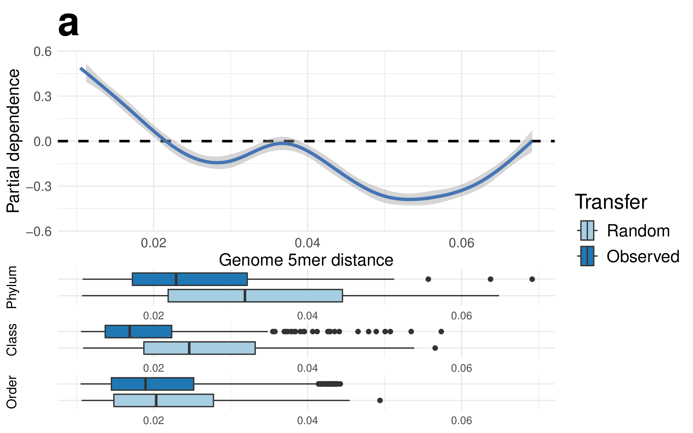
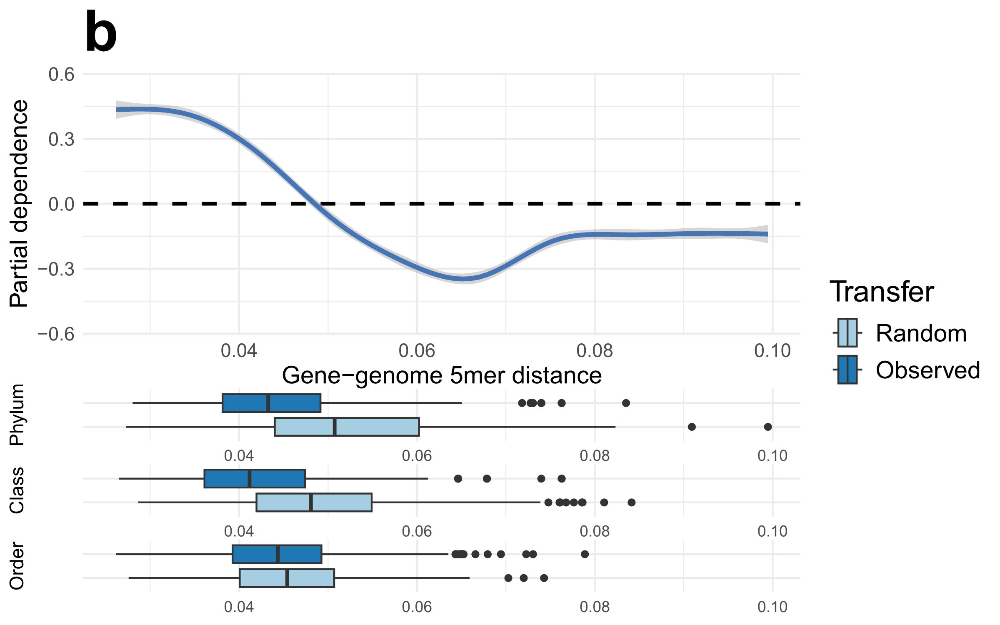
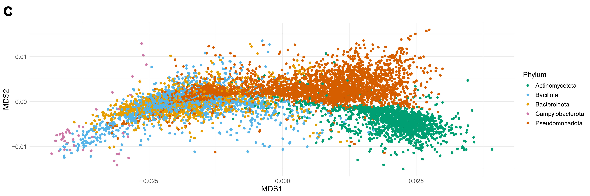

#----------------- Figure 4a,b ------------------------------------------------
# Load packages
library(caret)
library(dplyr)
library(forcats)
library(data.table)
library(randomForest)
library(pROC)
library(rfPermute)
library(rfUtilities)
library(pdp)
library(aplot)

# Functions
remove_redundant_events <- function(events) {
  uniq_events <- unique(events[, c("Node", "Gene.class")])
  subtable <- data.frame(matrix(nrow = 0, ncol = ncol(events)))
  colnames(subtable) <- colnames(events)
  
  for (i in seq_len(nrow(uniq_events))) {
    redundant_events <- events[events$Node == uniq_events$Node[i] & events$Gene.class == uniq_events$Gene.class[i], ]
    if (nrow(redundant_events) > 10) {
      subtable <- rbind(subtable, redundant_events[sample(seq_len(nrow(redundant_events)), 10), ])
    } else {
      subtable <- rbind(subtable, redundant_events)
    }
  }
  return(subtable)
}

subsample_null_events <- function(true, null) {
  gene_class <- unique(true$Gene.class)
  downsampled_events <- data.frame()
  tmp <- data.frame()
  
  for (class in gene_class) {
    n <- sum(true$Gene.class == class)
    subset <- null[null$Gene.class == class, ]
    if (nrow(subset) > n) {
      selection <- sample(seq_len(nrow(subset)), n)
      downsampled_events <- rbind(downsampled_events, subset[selection, ])
      tmp <- rbind(tmp, subset[-selection, ])
    } else {
      downsampled_events <- rbind(downsampled_events, subset)
    }
  }
  
  n_left <- nrow(true) - nrow(downsampled_events)
  downsampled_events <- rbind(downsampled_events, tmp[sample(seq_len(nrow(tmp)), n_left), ])
  
  return(downsampled_events)
}

format_input_data <- function(true_data, null_data, mechanism) {
  true_data$Transfer <- 1
  null_data$Transfer <- 0
  
  if (mechanism != "all") {
    if (mechanism == "class_A_C_D") {
      true_data <- true_data[true_data$Gene.class %in% c("class_A", "class_C", "class_D_1", "class_D_2"), ]
      null_data <- null_data[null_data$Gene.class %in% c("class_A", "class_C", "class_D_1", "class_D_2"), ]
    }
    
    else {
      true_data <- true_data[grep(mechanism, true_data$Gene.class), ]
      null_data <- null_data[grep(mechanism, null_data$Gene.class), ]
    }
  }
  
  true_data <- remove_redundant_events(true_data)
  if (nrow(null_data) > nrow(true_data)) {
    null_data <- subsample_null_events(true_data, null_data)
  }
  
  input_data <- rbind(true_data, null_data)
  input_data$Transfer <- as.factor(input_data$Transfer)
  input_data$Gene.class <- as.factor(input_data$Gene.class)
  
  input_data <- input_data %>%
    mutate(
      NN = as.integer(Gram_stain_difference == "NN"),
      PP = as.integer(Gram_stain_difference == "PP"),
      NP = as.integer(Gram_stain_difference == "NP")
    )
  
  return(input_data)
}

compile_distance_data <- function(input_data, variable) {
  distance_data <- input_data[, c("Taxonomic.difference", variable, "Transfer")]
  distance_data <- distance_data %>%
    mutate(
      Taxonomic.difference = recode(
        Taxonomic.difference,
        order = "Order",
        class = "Class",
        phylum = "Phylum"
      ) %>%
        as.factor() %>%
        relevel("Order")
    ) %>%
    mutate(
      Transfer = recode(
        Transfer,
        "1" = "Observed",
        "0" = "Random"
      ) %>%
        as.factor() %>%
        relevel("Random")
    )
}

create_partial_plot <- function(model, input_data, pred_var, class_idx, xlab, ylab, title) {
  part <- partial(model, pred.var = pred_var, type = "classification", which.class = class_idx)
  df <- data.frame(x = part[[pred_var]], y = part$yhat)
  
  p <- ggplot(df, aes(x = x, y = y)) +
    geom_hline(yintercept = 0, linetype = "dashed", linewidth = 1) +
    geom_smooth(size = 1.3, color = "#4575b4", method = "gam") +
    theme_minimal() +
    ggtitle(title) +
    xlab(xlab) +
    ylab(ylab) +
    ylim(-0.55, 0.55) +
    theme(
      axis.text.x = element_text(size = rel(1.3)),
      axis.text.y = element_text(size = rel(1.3)),
      axis.title = element_text(size = rel(1.3)),
      plot.title = element_text(size = rel(3), face = "bold")
    )
  
  return(p)
}

combine_plots <- function(main_plot, subplots, heights) {
  combined <- main_plot
  for (i in seq_along(subplots)) {
    combined <- insert_bottom(combined, subplots[[i]], height = heights[i])
  }
  return(combined)
}

set.seed(1)

# Analysis
observed_transfers <- data.frame(fread("D:/data_diver/Genetic_compatibility/data_for_figures/observed_horizontal_transfers.txt")) %>% 
  subset(select = -c(Header1, Header2)) %>%
  na.omit()

randomized_transfers <- read.delim(paste(c("D:/data_diver/Genetic_compatibility/data_for_figures/randomized_transfers1.txt"), collapse = "")) %>% 
  na.omit()

input_data <- format_input_data(observed_transfers, randomized_transfers, "all") %>% 
  subset(select = c(Taxonomic.difference, Gene.class, NN, PP, NP, Genome_5mer_distance,
                    Gene_genome_5mer_distance, Genome_size_difference,
                    Animal, Human, Soil, Water, Wastewater, Transfer))

train_index <- createDataPartition(input_data$Transfer, p = 0.7, list = FALSE)
train_set <- input_data %>% slice(train_index)
test_set <- input_data %>% slice(-train_index)

rf_model <- randomForest(
  Transfer ~ Gene.class +
    NN +
    PP +
    NP +
    Genome_5mer_distance + 
    Gene_genome_5mer_distance +
    Genome_size_difference + 
    Animal +
    Human +
    Soil +
    Water +
    Wastewater,
  data = train_set,
  ntree = 500,
  type = "classification",
  na.action = na.omit,
  importance = TRUE
)

# Compile results for Fig 4a
distance_data <- compile_distance_data(input_data, "Genome_5mer_distance") %>%
  mutate(Taxonomic.difference = factor(
    Taxonomic.difference,
    levels = c("Phylum", "Class", "Order") 
  ))

# Plot and save Fig 4a
p_main <- create_partial_plot(
  rf_model, input_data, "Genome_5mer_distance", 2,
  xlab = "Genome 5mer distance",
  ylab = "Partial dependence",
  title = "a"
)

box_plots <- lapply(levels(distance_data[["Taxonomic.difference"]]), function(level) {
  ggplot(distance_data %>% filter(!!sym("Taxonomic.difference") == level), 
         aes(x = Genome_5mer_distance, y = Transfer, fill = Transfer)) +
    geom_boxplot() +
    theme_minimal() +
    labs(x = NULL, y = level) +
    scale_fill_manual(values = c("#a6cee3", "#1f78b4")) +
    theme(
      axis.text.y = element_blank(),
      legend.position = ifelse(level == "Phylum", "right", "none"),
      legend.title = element_text(size=rel(1.5)),
      legend.text = element_text(size=rel(1.3)),
      legend.key.size = unit(0.75, 'cm')
    )
})

combined_plot <- combine_plots(p_main, box_plots, heights = c(0.2, 0.2, 0.2))

pdf("fig_4a.pdf", width = 8, height = 5)
print(combined_plot)
dev.off()

# Compile results for Fig 4b
distance_data <- compile_distance_data(input_data, "Gene_genome_5mer_distance") %>%
  mutate(Taxonomic.difference = factor(
    Taxonomic.difference,
    levels = c("Phylum", "Class", "Order") 
  ))

# Plot and save Fig 4b
p_main <- create_partial_plot(
  rf_model, input_data, "Gene_genome_5mer_distance", 2,
  xlab = "Gene-genome 5mer distance",
  ylab = "Partial dependence",
  title = "b"
)

box_plots <- lapply(levels(distance_data[["Taxonomic.difference"]]), function(level) {
  ggplot(distance_data %>% filter(!!sym("Taxonomic.difference") == level), 
         aes(x = Gene_genome_5mer_distance, y = Transfer, fill = Transfer)) +
    geom_boxplot() +
    theme_minimal() +
    labs(x = NULL, y = level) +
    scale_fill_manual(values = c("#a6cee3", "#1f78b4")) +
    theme(
      axis.text.y = element_blank(),
      legend.position = ifelse(level == "Phylum", "right", "none"),
      legend.title = element_text(size=rel(1.5)),
      legend.text = element_text(size=rel(1.3)),
      legend.key.size = unit(0.75, 'cm')
    )
})

combined_plot <- combine_plots(p_main, box_plots, heights = c(0.2, 0.2, 0.2))

pdf("fig_4b.pdf", width = 8, height = 5)
print(combined_plot)
dev.off()

#----------------- Figure 4c --------------------------------------------------
# Load packages
library(data.table)
library(dplyr)
library(vegan)

# Plotting settings
fig_c_theme <- theme(
  axis.text.x = element_text(size = rel(1.3)),
  axis.text.y = element_text(size = rel(1.3)),
  axis.title = element_text(size = rel(1.3)),
  legend.title = element_text(size = rel(1.2)),
  legend.text = element_text(size = rel(1)),
  plot.title = element_text(size = rel(3), face = "bold"),
  plot.title.position = "plot"
)

phylum_palette <- c(
  "Actinomycetota"='#009E73',
  "Bacillota" ="#56B4E9",
  "Bacteroidota"='#E69F00',
  "Campylobacterota"="#CC79A7",
  "Pseudomonadota"="#D55E00",
  "Other"="grey"
)

# Analysis
kmers <- fread("D:/data_diver/Genetic_compatibility/data_for_figures/representative_kmer_distributions.txt") %>% as.data.frame()
taxonomy <- data.frame(fread("D:/data_diver/Genetic_compatibility/data_for_figures/assembly_full_lineage.txt", header=FALSE)) %>%
  select(c(3:5)) %>%
  na.omit() %>%
  unique() %>%
  `colnames<-`(c("phylum", "class", "order")) %>%
  `rownames<-`(.$order)

phylum <- taxonomy[kmers[, 1], 1]
rel_phyl <- c("Actinomycetota", "Bacillota", "Bacteroidota", "Campylobacterota", "Pseudomonadota")
phylum <- ifelse(phylum %in% rel_phyl, phylum, "Other")

data <- kmers[, -1]
data <- data[phylum != "Other", ]
phylum <- phylum[phylum != "Other"]

kmers_mds <- metaMDS(comm = data, distance = "euclidean", trace = TRUE, autotransform = FALSE)

# Complile results
MDS_xy <- data.frame(kmers_mds$points)
MDS_xy$phylum <- phylum

# Plot and save Fig 4c
fig_4c <- ggplot(MDS_xy, aes(x = MDS1, y = MDS2, color = phylum)) +
  geom_point(size = 1.5) +
  scale_color_manual(
    values = phylum_palette,
    name = "Phylum"
  ) +
  theme_minimal() +
  ggtitle("c") +
  fig_c_theme

pdf("fig_4c.pdf", height = 5, width=15)
plot(fig_4c)
dev.off()

#安装“Markdown All in One”扩展后，使用Ctrl+Shift+V 打开预览窗口

