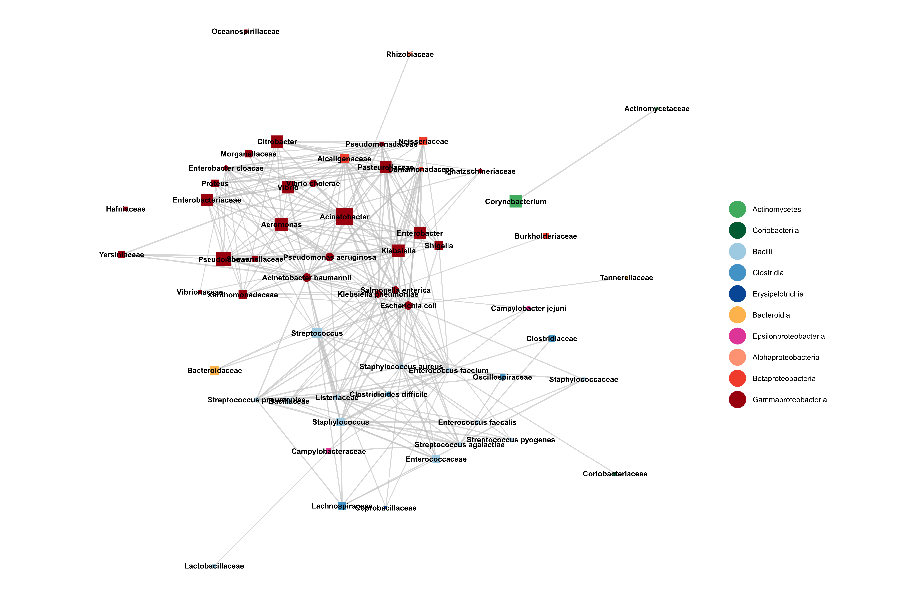
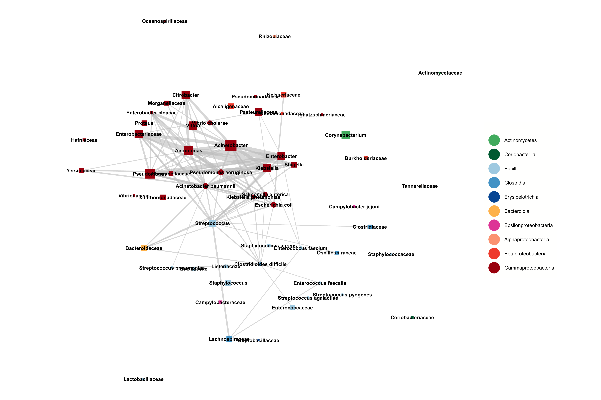

#----------------- Figure 5 ---------------------------------------------------
# Load packages
library(igraph)
library(stringr)
library(GGally)
library(ggplot2)
library(tidyr)
library(data.table)
library(dplyr)

# Functions
plot_cooccurrence_network <- function(graph, environment) {
  size <- c()
  for (name in V(graph)$name) {
    size <- c(size, sum(co_occurrence[co_occurrence$Species1 == name | co_occurrence$Species2 == name, "n.true"]))
  }
  
  genus <- c()
  for (name in V(graph)$name) {
    genus <- c(genus, str_split(name, " ")[[1]][1])
  }
  
  V(graph)$label <- taxonomy[genus,3]
  
  for (i in 1:length(V(graph)$label)) {
    if (is.na(V(graph)$label[i])) {
      V(graph)$label[i] <- taxonomy[taxonomy$family == genus[i],3][1]
    }
  }
  
  env_list <- c("Animal", "Human", "Soil", "Water", "Wastewater")
  
  imp <- edge_attr(graph)[[grep(environment, env_list)]]
  
  imp[is.na(imp)] <- 0
  imp[imp < 0.01] <- 0
  texture <- c()
  alph <- c()
  
  for (i in 1:length(imp)) {
    if (is.na(imp[i])) {
      texture <- c(texture, 0)
      alph <- c(alph, 0)
    }
    else if (imp[i] == 0) {
      texture <- c(texture, 3)
      alph <- c(alph, 0)
    }
    else if (imp[i] > 0 && imp[i] <= 0.01) {
      texture <- c(texture, 1)
      alph <- c(alph, 0.6)
    }
    else if (imp[i] > 0.01 && imp[i] <= 0.03) {
      texture <- c(texture, 1)
      alph <- c(alph, 0.6)
    }
    else if (imp[i] > 0.03) {
      texture <- c(texture, 1)
      alph <- c(alph, 0.6)
    }
  }
  
  E(graph)$lty <- texture
  E(graph)$color <- "#bdbdbd"
  
  node_color <- c("#41ab5d", "#005a32", "#9ecae1", "#4292c6", "#084594", 
                  "#feb24c", "#dd3497", "#fc9272", "#ef3b2c", "#99000d")
  
  names(node_color) <-c("Actinomycetes", "Coriobacteriia", "Bacilli", "Clostridia",
                        "Erysipelotrichia", "Bacteroidia", "Epsilonproteobacteria",
                        "Alphaproteobacteria", "Betaproteobacteria", "Gammaproteobacteria")
  
  esize <- sqrt(imp*20)
  esize[esize == 0] <- 0.5
  
  shape <- rep(15, length(V(graph)$name))
  shape[grep(" ", V(graph)$name)] <- 19
  
  set.seed(444)
  
  #调用GGally包中的ggnet2需要下载"network", "sna", "scales"包
  p <- ggnet2(graph, 
              mode = "kamadakawai", 
              color=V(graph)$label, 
              palette = node_color, 
              edge.alpha = alph, 
              edge.size = esize, 
              alpha = 1, size = size, 
              edge.color = E(graph)$color, 
              edge.lty = E(graph)$lty, 
              legend.size = 9, 
              layout.exp = 0.1,
              node.shape = shape) +
    geom_text(aes(label = V(graph)$name), color = "black", size=3, fontface = "bold") +
    guides(size = FALSE) +
    coord_fixed()
}

# Load data
taxonomy <- data.frame(fread("D:/data_diver/Genetic_compatibility/data_for_figures/assembly_full_lineage.txt", header=FALSE)) %>%
  select(-c(1,ncol(.))) %>%
  na.omit() %>%
  unique() %>%
  `colnames<-`(c("kingdom", "phylum", "class", "order", "family", "genus")) %>%
  `rownames<-`(.$genus)

co_occurrence <- read.table("D:/data_diver/Genetic_compatibility/data_for_figures/species_cooccurrence.txt", header = TRUE, sep="\t") %>%
  .[!(is.na(.$Species2) | is.na(.$Species1)),]

co_occurrence <- co_occurrence[order(co_occurrence$n.true, decreasing = TRUE), ]

prio_list <- c("Mycobacterium tuberculosis", "Staphylococcus aureus", "Escherichia coli", 
               "Streptococcus pneumoniae",  "Klebsiella pneumoniae", "Pseudomonas aeruginosa", 
               "Acinetobacter baumannii", "Enterobacter cloacae", "Streptococcus agalactiae", 
               "Enterococcus faecalis", "Enterococcus faecium", "Salmonella enterica", 
               "Streptococcus pyogenes", "Neisseria meningitidis","Campylobacter jejuni", 
               "Vibrio cholerae", "Clostridioides difficile")

# Aggregate species to genus-level
sp <- unique(c(co_occurrence$Species1, co_occurrence$Species2))
for (name in sp) {
  if (name %in% prio_list) {
    next
  }
  else {
    co_occurrence$Species1[co_occurrence$Species1 == name] <- str_split(name, " ")[[1]][1]
    co_occurrence$Species2[co_occurrence$Species2 == name] <- str_split(name, " ")[[1]][1]
  }
}

# Filter non-frequent pairs
df <- co_occurrence[co_occurrence$n.true >= 5, ]

sp <- unique(c(df$Species1, df$Species2))
df2 <- data.frame(matrix(nrow = 0, ncol = 8))
included <- c()

for (name in sp) {
  subset <- df[df$Species1 == name | df$Species2 == name,]
  
  for (i in 1:nrow(subset)) {
    if (paste(subset$Species1[i], subset$Species2[i]) %in% included || paste(subset$Species2[i], subset$Species1[i]) %in% included) {
      next
    }
    
    else {
      included <- c(included, paste(subset$Species1[i], subset$Species2[i]))
      subset2 <- subset[subset$Species1 == subset$Species1[i] & subset$Species2 == subset$Species2[i] | subset$Species1 == subset$Species2[i] & subset$Species2 == subset$Species1[i],]
      df2 <- rbind(df2, c(subset$Species1[i], subset$Species2[i], max(na.omit(subset2$Animal)), max(na.omit(subset2$Human)), max(na.omit(subset2$Soil)), max(na.omit(subset2$Water)), max(na.omit(subset2$Wastewater)), sum(na.omit(subset2$n.true))))
    }
  }
}

colnames(df2) <- colnames(df)

for (i in 3:8){
  df2[,i] <- as.numeric(df2[,i])
}

df2[df2 == -Inf] <- 0

# Generate initial graph
g <- graph_from_data_frame(d = df2, directed = FALSE) #graph.data.frame()` was deprecated in igraph 2.0.0，使用`graph_from_data_frame()`替代

# Aggregate uncommon genera to family level
size <- c()
for (name in V(g)$name) {
  size <- c(size, sum(co_occurrence[co_occurrence$Species1 == name | co_occurrence$Species2 == name, "n.true"]))
}

prio_list <- data.frame(V1 = c(prio_list, head(V(g)$name[order(size, decreasing = TRUE)], 15)))

sp <- unique(c(df2$Species1, df2$Species2))
for (name in sp) {
  if (name %in% prio_list$V1) {
    next
  }
  else {
    co_occurrence$Species1[co_occurrence$Species1 == name] <- taxonomy[str_split(name, " ")[[1]][1], 5]
    co_occurrence$Species2[co_occurrence$Species2 == name] <- taxonomy[str_split(name, " ")[[1]][1], 5]
    
    df2$Species1[df2$Species1 == name] <- taxonomy[str_split(name, " ")[[1]][1], 5]
    df2$Species2[df2$Species2 == name] <- taxonomy[str_split(name, " ")[[1]][1], 5]
  }
}

sp <- unique(c(df2$Species1, df2$Species2))
df3 <- data.frame(matrix(nrow = 0, ncol = 8))
included <- c()

for (name in sp) {
  subset <- df2[df2$Species1 == name | df2$Species2 == name,]
  
  for (i in 1:nrow(subset)) {
    if (paste(subset$Species1[i], subset$Species2[i]) %in% included || paste(subset$Species2[i], subset$Species1[i]) %in% included) {
      next
    }
    
    else {
      included <- c(included, paste(subset$Species1[i], subset$Species2[i]))
      subset2 <- subset[subset$Species1 == subset$Species1[i] & subset$Species2 == subset$Species2[i] | subset$Species1 == subset$Species2[i] & subset$Species2 == subset$Species1[i],]
      df3 <- rbind(df3, c(subset$Species1[i], subset$Species2[i], max(na.omit(subset2$Animal)), max(na.omit(subset2$Human)), max(na.omit(subset2$Soil)), max(na.omit(subset2$Water)), max(na.omit(subset2$Wastewater)), sum(na.omit(subset2$n.true))))
    }
  }
}

colnames(df3) <- colnames(df2)

for (i in 3:8){
  df3[,i] <- as.numeric(df3[,i])
}

# Generate final network
g <- graph_from_data_frame(d = df3, directed = FALSE)

# Plot and save subfigures
fig_5a <- plot_cooccurrence_network(g, "Human")

pdf("fig_5a.pdf", width = 15, height = 10)
plot(fig_5a)
dev.off()

fig_5b <- plot_cooccurrence_network(g, "Wastewater")

pdf("fig_5b.pdf", width = 15, height = 10)
plot(fig_5b)
dev.off()

#安装“Markdown All in One”扩展后，使用Ctrl+Shift+V 打开预览窗口

